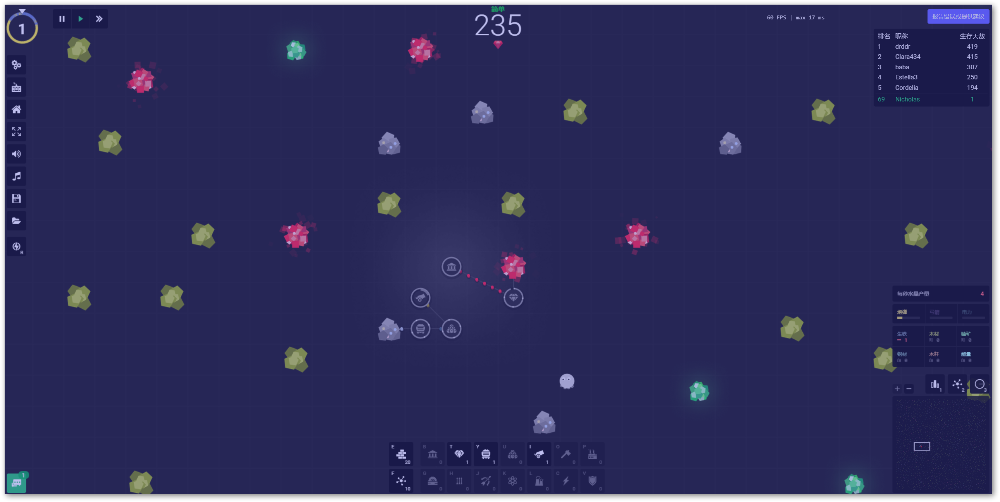
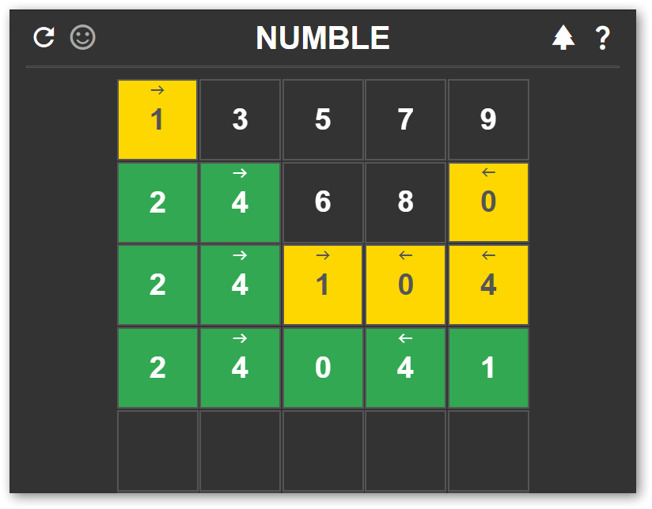
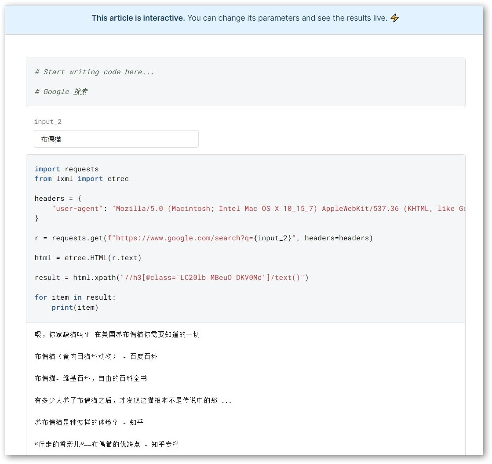

# InLoop 周刊（第 1 期）：知晓某事≠知道某事

Tags: 周刊  
url: https://mp.weixin.qq.com/s/Tq8JFAjVqZtr0UVXEFUu5g  
创建时间: March 26, 2022 4:29 PM  
周刊: Yes  
归档: Yes  

在这里记录一周，我看到的值得分享的东西

我喜欢将一些有趣的东西放入收藏夹，却几乎没有翻阅过它们

看了阮一峰大佬的 **[科技爱好者周刊](https://www.ruanyifeng.com/blog/weekly/)**，也许写文章是个不错的注意！

## 知晓某事 知道某事

如果你的笔记本充斥着剪藏来的内容，充斥着别人的观点，充斥着从未拆封的文章，那么大概率，你手中的地图，是别人塞给你的；你的大脑，是别人思维的跑马场。

在你感兴趣的事情上投入时间和精力，而不仅仅是收藏。真正的知识不是书本上的那些单词，而是你基于那些信息亲自实践之后得到的东西。即使最后一本书只记得一句话，也没什么不好！

## 一言

对未来最大的慷慨，就是把一切献给现在

## 摸鱼

1. [YORG.io](https://yorg.io/)
   
    戴森球Online青春版🤣，支持存档导出，拥有武器系统，摸鱼upup
    
    
    
2. [Numble](https://codepen.io/grum/full/rNGQZXB)
   
    数字版 Wordle，更加友好的提示
    
    
    

## 工具

1. [DeepNote](https://deepnote.com/)
   
    > 一款支持实时协作的在线 Jupyter 笔记本。
    > 
    
    分享笔记本为交互式文章，仪表盘或者 Web应用。
    
    [谷歌搜索](https://deepnote.com/@zzzzls/Demo-M3ztGGCoTtisj5GPiuwKTQ)：
    
    
    

## Coding

1. Go build 瘦身
   
    
    
    ```go
    // demo.go
    package main
    
    import (
    	"fmt"
    	"io/ioutil"
    	"net/http"
    )
    
    func main() {
    	resp, err := http.Get("https://httpbin.org/get")
    	if err != nil {
    		panic(err)
    	}
    	defer resp.Body.Close()
    	content, err := ioutil.ReadAll(resp.Body)
    	if err != nil {
    		panic(err)
    	}
    	fmt.Println(string(content))
    }
    ```
    
    - 禁用符号表 & 调试信息 & 函数内联 & 边界检查
      
        ```go
        go build -ldflags="-s -w" -gcflags=all="-l -B"
        ```
        
    - UPX 压缩
      
        ```go
        upx -9 -o main.exe main.exe
        ```
        
    
2. 恶意图片扫描器
   
    有的网站给你发送的邮件中，不论是营销邮件还是垃圾邮件或是其他的东西，在邮件正文插入一个 1 像素的图片，图片的 URL 都是精心设计好的，当你打开邮件的时候，发送者就可以知道：
    
    - 谁
    - IP
    - 什么时间
    - 什么设备
    - 什么网络
    
    从而对这个营销邮件的效果进行分析，比如发送了 1000 封邮件，有多少人打开之类的
    
    甚至可以挖出你的兴趣，比如给你发不同的邮件主题，购物的，创业的，培训班的等等，看你都打开了哪些，给你打上标签...
    
    所以现在一般的邮件客户端默认不加载图片，一是节省打开邮件的时间，二是保护你的隐私
    
3. [Xvfb](https://mp.weixin.qq.com/s/U-o58Bi0B7kMocwxqlptfA)
   
    当我们在 Linux 服务器上使用 selenium 或 Puppeteer 有头模式时总是会报错。这是因为，有头模式需要系统提供图形界面支持，但是 Linux 服务器一般来说是没有图形界面的。
    
    ```go
    import time
    from selenium.webdriver import Chrome
    from selenium.webdriver.chrome.options import Options
    
    options=Options()
    options.add_argument("--no-sandbox")
    options.add_argument("--disable-dev-shm-usage")
    options.binary_location = "/usr/bin/chromium-browser"
    
    driver = Chrome(chrome_options=options, executable_path='./chromedriver')
    driver.get('https://httpbin.org/get')
    time.sleep(2)
    driver.save_screenshot('screenshot.png')
    driver.close()
    print('运行完成')
    ```
    
    为了实现上述需求，我们可以使用一个叫做 `Xvfb` 的东西。它实现了图形界面的各种接口，当一个程序在 Xvfb 中调用图形界面相关的操作时，这些操作都会在虚拟内存中运行，只不过你什么都看不到而已。
    
    安装 & 使用
    
    ```bash
    yum install Xvfb -y
    
    Xvfb-run python3 test.py
    ```
    
    类似工具：
    
    - pyvirtualdisplay
    - xvfbwrapper

## 文摘

1. 黑客伦理
   
    ```go
    1. 对计算机的访问（以及可能帮助你认识我们这个世界的事物）应该是不受限制的，完全的，任何人都有动手尝试的权利
    2. 所有的信息应该可以自由获取
    3. 不迷信权威
    4. 评判黑客的标准应该是它们的技术，而不是那些没有实际用途的指标，比如学位，年龄，种族或职位
    5. 你可以在计算机上创造出美与智慧
    6. 计算机可以让你的生活更美好
    ```
    
1. 如何应对缺点
   
    ```go
    1. 嘴硬
    2. 承认缺点并改变自身
    3. 承认缺点并寻找绕过的方法
    4. 或者，改变你的目标
    ```
    
2. 敌人对你最大的伤害
   
    ```go
    有人尖刻的嘲讽你，你马上尖酸的回应他
    有人毫无理由的看不起你，你马上轻蔑的鄙视他
    有人在你面前大肆炫耀，你马上加倍证明你更厉害
    有人对你冷漠，你马上对他冷淡疏远
    
    看，你讨厌的那些人
    轻易的把你变成你自己最讨厌的样子
    ```
    
3. 为什么假新闻总有人相信
   
    ```go
    任何想法真正死亡，只有一个办法，就是不在有人谈论它。
    
    因此，对于一些假新闻或坏想法，一旦你重复引用这些内容，它们就不会被忘记。而且重复的次数越多，人们越有可能去相信它
    
    这被称为，克利尔重复定律：相信某个想法的人数，与该想法在过去一年中被重复的次数成正比，即使该想法是明显错误的
    
    每次你攻击一个错误的想法，就是在喂养你试图摧毁的怪物
    ```
    

## 新奇

 1. 日历拼图

仅有 11 片，却号称可以拼出全年 365 天任意一个日期，除了月、日、还有星期。

> [史上最变态的日历！每一天都要靠拼图拼出来？！](https://www.bilibili.com/video/BV1Eb4y177Hs)
> 

