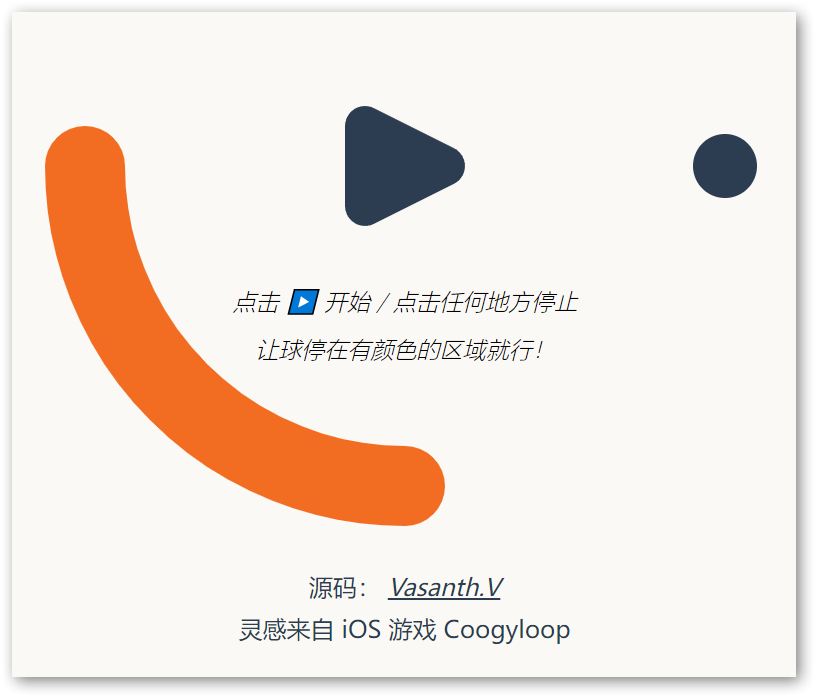
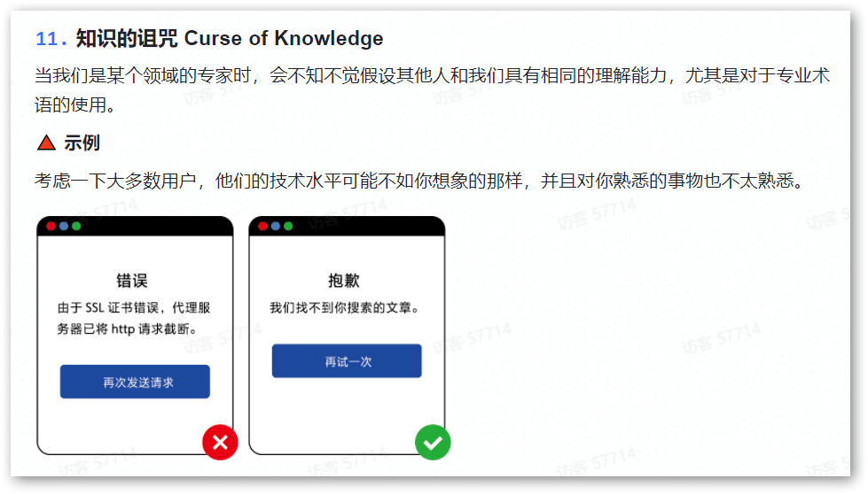

# InLoop 周刊（第 2 期）：为什么要写技术周刊

Tags: 周刊  
创建时间: March 31, 2022 11:46 AM  
周刊: Yes  
归档: Yes  

# 一言

克制才是保持热爱的秘诀

# 娱乐

1. [Looptap](https://hellogithub.com/onefile/code/cc759276aefe4bad87ac259940042581)
   
    让小球停在指定的位置
    
    
    

# 新奇

1. [此人不存在](https://thispersondoesnotexist.com/)
   
    访问该网站会随机显示一张人像照片，这些照片都是由 AI 合成的，真人并不存在
    
    
    
2. [死刑犯遗言](https://www.tdcj.texas.gov/death_row/dr_executed_offenders.html)
   
    美国德州政府的一个网页，专门用来收集犯人执行死刑前的遗言
    

# 工具

1. [hh-lol-prophet](https://github.com/real-web-world/hh-lol-prophet)
   
    LoL 牛马分析程序，基于 lol client api，选人阶段统计近期战绩判断己方上等马，下等马
    
2. [Chrome 支持跳转到指定文字](https://www.chromestory.com/2019/02/chrome-scroll-to-text/)
   
    Chrome 支持跳转到指定文字，而不需要锚点。做法是 URL 后面设置 `#:~:text=Install` ，然后就会跳转到网页第一个出现 `Install` 的地方。
    
    或者在网页上选择文字后，右键选择 `复制指向突出显示的内容的链接`
    
3. [curlconverter](https://github.com/curlconverter/curlconverter)
   
    将 Curl 命令转换为编程语言代码
    
4. [Hertzbeat](https://hertzbeat.com/)
   
    开源的监控告警系统，可用于 网站，Ping连通性，端口可用性，数据库检测，支持 邮箱，Webhook，钉钉，企业微信，飞书等告警通知
    
5. [Termtosvg](https://github.com/nbedos/termtosvg)
   
    使用这个工具可以将录制你的命令行操作，并保存为一个 svg 动画
    
1. **[Sketch 2 Code](https://sketch2code.azurewebsites.net/)**
   
    微软的在线工具，将手绘彩图转换为 HTML 代码
    
    
    
1. [飞书：认知偏差知识手册](https://s75w5y7vut.feishu.cn/docs/doccn3BatnScBJe7wD7K3S5poFf)
   
    文章列举了 67 条心理学知识词条，并配以图文形象展示
    
    
    

# 文摘

1. [怎样清晰地表达自己的观点？](https://www.ruanyifeng.com/blog/2020/03/weekly-issue-98.html)
   
    请看下面这句话，你对它留下深刻印象吗？
    
    ```python
    问：死海的特点是什么？
    
    答：盐湖位于以色列和约旦之间的边界。它的海岸线是地球表面的最低点，
       平均低于海平面 396m。长 74 公里。它的咸度是海洋的 7 倍（按体
       积计 30% ）。它的密度使游泳者得以漂浮。只有简单的生物才能生活在
       其盐水中。
    ```
    
    修改一下，是不是效果好了很多。
    
    ```python
    问：死海在哪里？
    答：在以色列和约旦之间的边界上
    
    问：地球表面的最低点是什么？
    答：死海海岸线
    
    问：死海的平均水位是多少？
    答：400米（海平面以下）
    
    问：死海多长？
    答：70公里
    
    问：死海比海洋更咸？
    答：7倍
    
    问：死海中盐的体积含量是多少？
    答：30%
    
    问：为什么死海能让游泳者继续漂浮？
    答：由于含盐量高
    
    问：为什么死海被称为死海？
    答：因为只有简单的生物才能生活在其中
    
    问：为什么只有简单的生活才能生活在死海中？
    答：由于含盐量高
    ```
    
    这里不是推荐大家使用问答体，而是想要展示两个小技巧，可以快速提升表达效果。
    
    - 拆分
      
        内容尽量拆分一系列简短而明确的小观点，粒度要细到每个观点都可以让人快速地，一目了然地领会
        
    - 反复
      
        开头的几点用来吸引读者的注意力，然后进入核心部分时，采用各种形式反复展示，力求给人留下深刻印象
        
    
    一点一点地展示，让别人跟上你。即使他们没有跟你一直走到底，只看了一半，也好过一点没看进去。
    
2. [为什么要写技术周刊？](https://mp.weixin.qq.com/s/86Cz3KUWqutu9J0V4tyabQ)
   
    既想写给现在的自己，也想贪心写给 10 年，20 年后的工程师们，现在的你站在浪潮之巅，面对魔幻的互联网世界，很容易把一条河流看成整片大海
    
    未来的读者已经知道了这段技术的发展历史，但难免会忽略一些细节。如果未来的工程师们真的创造出了时间旅行机器，可以让你回到现在。
    
    那么技术周刊就是你和当年工程师们的接口暗号，你能感知到他们在这个时代的键盘上留下的余温。
    
3. [丰富市场的悖论](https://perell.com/note/the-paradox-of-abundance/)
   
    互联网时代的信息质量，呈现两极化。信息的平均质量变得越来越差，但是你能从网上找到的最有用的信息，质量正越来越好。
    
    这就好比一个商品极大丰富的市场，对普通消费者是不利的，因为他不知道怎么选择琳琅满目的商品；但对高水平的消费者非常有利，因为他总能找到最满足自己需要的商品。
    
1. 区块链的流行场景
   
    只有一个场景，区块链是很好的解决方案，也是唯一的解决方案；交易双方互不信任，无法使用合同和法律制度。换句话说，就是违法的事情。其他场景，数据库和各方之间的合同是更好的解决方案。
    

### 脑筋急转弯

张三看着小红，小红看着李四。已知，张三已婚，小红未婚，请问，是否有一名已婚人士看着未婚人士？

- A、是
- B、不是
- C、不确定