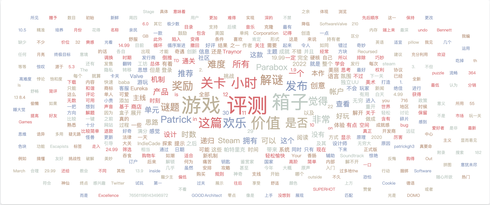
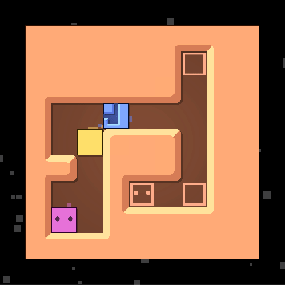

# InLoop 周刊（第 4 期）：卫星地图 & 鸟儿模式

Tags: 周刊  
创建时间: April 14, 2022 2:39 PM  
周刊: Yes  
归档: Yes  

# 一言

行百里者半九十

# 工具

1. [How annoying is too annoying?](https://audio-delay.glitch.me/)
   
    一个测试音乐或打字延迟的网站，让你感受一下延迟带来的『血压上升』
    
1. [SingleFile](https://chrome.google.com/webstore/detail/singlefile/mpiodijhokgodhhofbcjdecpffjipkle)
   
    一款浏览器插件，将网页完整的『包含 HTML，JS，CSS，图片等资源』保存到一个 HTML 文件中
    
2. [NiucoData](https://cloud.niucodata.com/)
   
    在线生成词云图
    
    
    
3. [skill-icons](https://github.com/tandpfun/skill-icons)
   
    展示你的技能图标
    
    [https://skillicons.dev/icons?i=js,html,css,wasm,go,python,java,c,docker&theme=light&perline=3](https://skillicons.dev/icons?i=js,html,css,wasm,go,python,java,c,docker&theme=light&perline=3)
    
    ```go
    https://skillicons.dev/icons?i=js,html,css,wasm,go,python,java,c,docker&theme=light&perline=3
    ```
    
1. [UIColors](https://uicolors.app/create)
   
    通过一个颜色生成一组相关的颜色
    
1. [TableConvert](https://tableconvert.com/zh-CN/)
   
    不同数据类型互相转换，`「CSV，JSON，SQL，Markdown」 <==> 「CSV，JSON，SQL，Markdown」` 
    

# 娱乐

1. [Patrick's Parabox](https://store.steampowered.com/app/1260520/Patricks_Parabox/)
   
    推箱子永不过时！
    
    
    
1. [bruno-simon](https://bruno-simon.com/)
   
    基于 Three.js 的 3D 小车，拥有极佳的碰撞体验。感兴趣可以看看[作者开发过程](http://yearito.cn/posts/Bruno-Simon-Portfolio.html)
    
    
    
1. [quickdraw](https://quickdraw.withgoogle.com/)
   
    人工智能识别你的画作！
    
    
    

# 资讯

1. [100 cool web moments](https://developer.chrome.com/100/)
   
    2022 年 3 月 29 日，Chrome 迎来了第 100 个版本，本文为其官方整理的自 2008 年 Chrome 发布至今互联网上 100 个令人惊叹的时刻
    

# 文摘

1. [眼镜蛇效应](https://zh.wikipedia.org/wiki/%E7%9C%BC%E9%95%9C%E8%9B%87%E6%95%88%E5%BA%94)
   
    指的是解决某个问题的方案，反而使得该问题恶化。
    
    它来自于殖民时期的印度，政府颁布法令说每打死一条眼镜蛇就可以领取赏金。结果，民众为了赏金开始养殖眼镜蛇，政府不得不取消赏金，养殖蛇的人就把蛇都放了，放出去的蛇继而繁殖，反而使得眼镜蛇数量大增。
    
2. [谷歌地图的卫星模式名称](https://threadreaderapp.com/thread/1099370126678253569.html)
   
    2005 年 2 月份，我们推出了谷歌地图。到了夏天，我们加入了卫星图像功能，取名『卫星图层』，只要通过高层的审核，就可以发布了。
    
    
    
    这时，团队内部发生了一场令人啼笑皆非的争论。有人发现这些卫星照片，很多不是卫星拍摄的，而是在飞机上拍摄的，所以 『卫星图层』不是正确的名称，建议改为『航空摄影图层』。
    
    一些工程师不同意修改，谁会在乎呢，到底是从哪里拍摄的？而且『航空摄影图层』作为一个名字，也太长了。另一些工程师认为不能撒谎，必须使用正确的名字。
    
    谁都不能说服对方。发布审查会之前，我们无法解决分歧，带着一个未命名的功能，进入了会议室。
    
    就像大家预料的，每一位谷歌高管都开始兴致勃勃地讨论，应该使用哪个名字，有些人还提出了其它名字。谷歌创始人拉里和谢尔盖都喜欢讨论疯狂的想法。
    
    最后，谢尔盖拍板：”我们叫它 『鸟儿模式』”。
    
    我马上想发言，但是谢尔盖已经宣布散会了。
    
    我目瞪口呆，该功能刚才正式命名为『鸟儿模式』，实在太疯狂了。
    
    接下来的几天，工程师们都吓坏了。大家知道这个功能非常重要，可是『鸟儿模式』这个名字，让卫星派和航空摄影派都感到很糟糕，但它是老板决定的。
    
    我们该怎么办？
    
    最后，大家决定不用『鸟儿模式』，就用 『卫星』这个词，反正我们编写代码，有控制权。事实证明，几乎没有高管注意到或记得这个变化。
    
    从那以后，谷歌地图就一直使用『卫星图层』作为名字，但照片大部分都不是卫星拍的。