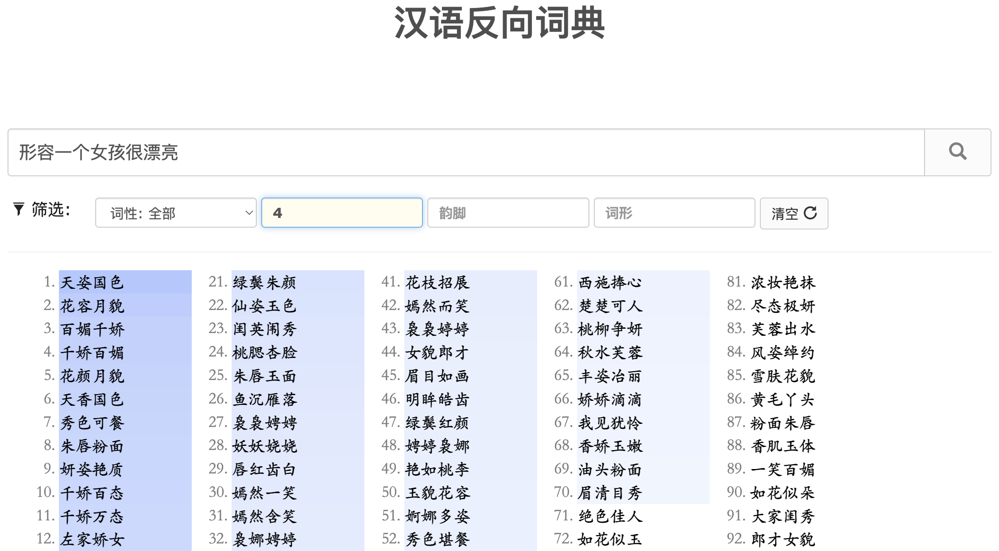

# InLoop 周刊（第 7 期）：消失的10天

Tags: 周刊  
创建时间: May 19, 2022 11:40 PM  
周刊: No  
归档: No  

# 一言

很多人，能忍受生活的痛苦，唯独受不了读书的苦。但他们不知道的是，生活的苦对你是一种消耗；而读书的苦，对你是一种积累，是一种重塑！

# 工具

1. [反向词典](https://wantwords.net/)
   
    不知道大家有没有碰到这样的场景，比如话到嘴边不知道怎么明确表达一个词，只能感慨一声书到用时方恨少。别着急，你可以试试这个由清华大学自然语言处理与社会人文计算实验室开发的反向词典
    
    
    
2. [正则可视化](https://devtoolcafe.com/tools/regex)
   
    
    
3. [Code996](https://github.com/hellodigua/code996)
   
    一款开源的分析工具，统计 Git 项目的 commit 时间分布，推导出这个项目的编码工作强度！
    
    
    
    
    

# 冷知识

- 消失的 10 天
  
    如果你查看 1582 年的日历，你会看到一个奇葩的事情，当年的 10 月份从 4 日直接跳到了 15 日，有 10 天不见了！
    
    
    
    出现这种情况，并不是那一年发生了什么重大时间，而是由于先前的历法不完善导致的。
    
    我们现在使用的公历是格里历，这个历法前身是儒略历法。在儒略历法中，一年平均长度为 365.25 天。而在天文学中，地球环绕太阳转动一圈的时间才是真正意义的一年，周期约是 365.2422 天，与儒略历每年有 11 分钟左右误差。
    
    到了公元 1582 年，随着天文观测技术进步，人们发现实际上春分已经提前到 3月11 日，比原定提前了 10 天，这给现实生活带来了很多麻烦，农民要根据节气种地，教会也要根据春分确定复活节，长此以往，耶稣究竟在哪一天「复活」的，都成了一个问题！
    
    于是当时的教皇颁布训令，调整一年的周期，同时将 10月4日 到 10月15日抹掉，重新与太阳年同步！
    

# 文摘

- 超前的数学家
  
    做物理和化学实验时，实验环境是很重要的，要尽量排除掉摩擦力、杂质、人的观察误差等因素，才能得出更接近真理的结论。
    
    而是数学和逻辑的实验，是全程在思维这个抽象世界里进行的，它不受任何现实因素的影响，百分百规避所有现实的误差，这是一个多么理想多么极致的实验环境。在这个环境里得出来的结论，才是我们这个世界最本质最客观的规律，所以顶尖的数学家们往往不受当下科学水平的限制，可以在脑子里完成一个非常超前的理论！
    
- [燃烧的铁轨](https://www.popularmechanics.com/science/a35405652/chicago-lighting-railroads-on-fire-switch-heaters-winter/)
  
    美国芝加哥火车站，冬季严寒，铁轨会结冰，这对火车行驶很不安全。为了除冰，铁路公司在铁轨上装了燃气管道。一但有列车通过，就会自动打开燃气喷头，火车就会在火焰中前进。
    
    
    
    