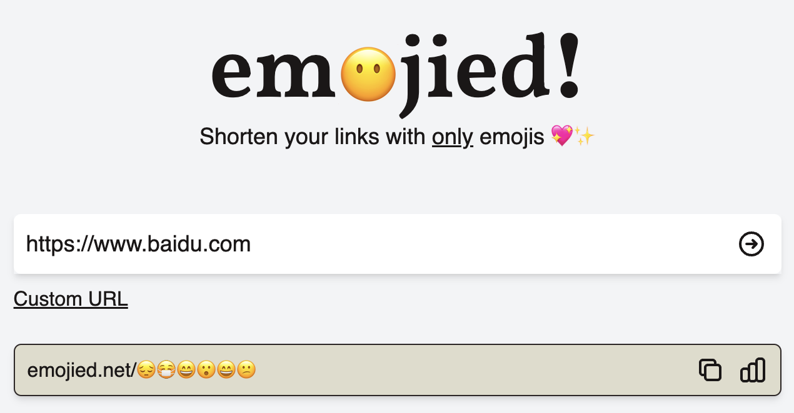

# InLoop 周刊（第 8 期）：http 402 需要付费

Tags: 周刊  
创建时间: May 23, 2022 6:10 PM  
周刊: No  
归档: No  

# 工具

- [Emojied](https://emojied.net/)
  
    把网址转换为 Emoji 符号
    
    
    
- [beautify-github-profile](https://github.com/rzashakeri/beautify-github-profile)
  
    美化你的 Github 主页
    
    
    
- ****[Q.Link](https://links.bestxtools.com/q-link.minung.dev/)****
  
    一款链接分享工具，访问者必须答对你设定的问题，才能访问你的链接。
    
    体验：[https://q-link.minung.dev/links/62931d7224dea1655c28d9ee](https://q-link.minung.dev/links/62931d7224dea1655c28d9ee)
    
    
    
- [CodeCaptcha.io](https://links.bestxtools.com/www.codecaptcha.io/)
  
    程序员专用链接分享，访问者必须完成随机的编程问题，才能访问你的链接。
    
    
    
- [utterances](https://utteranc.es/)
  
    一个将 GitHub issues 用作静态页面评论功能的开源库
    

# 文摘

1. [5G 手机壳](https://www.ithome.com/0/618/805.htm)
   
    最近，出现了一种 5G 手机壳，售价 799 元。只要套上这种壳，手机就具备双模 5G 通信能力。它明显是为华为而发明的，华为被制裁无法拿到 5G 芯片，只能生产 4G 手机。
    
    这种手机壳重量约为 52g，有自己的 CPU，需要手机主卡开通 eSIM 服务，已适配华为 P50 Pro 机型。
    
    
    
1. [真实版网络谜踪](https://sspai.com/post/73193)
   
    2011 年，一则名为《我是如何推理出王珞丹住址的？》的帖子被疯狂转载。帖子作者凭借王珞丹几条微博、自己对北京城的了解和 Google Earth，用时四十多分钟就推理出了王珞丹前住址。
    
    今天，在众多爱好者和创作者的引介下，一种被称为「网络谜踪」的侦探游戏进入大众视野：在只有一张图片和寥寥提示的条件下，大神们仅凭一台联网的电脑，足不出户即可找到图片拍摄地。
    
    文章详细介绍了网络谜踪的玩法，跟随侦探的脚步一步步抽丝剥茧享受解谜的乐趣
    
    
    
1. [402 Payment Required](https://www.zhihu.com/question/30692393)
   
    如果你对 HTTP 状态码有所了解，你会知道 4xx 代表客户端错误，更详细的话你会知道：
    
    - 400 请求错误
    - 401 未授权
    - 403 禁止访问
    - 404 找不到请求的资源
    
    你是否发现了盲点，402 呢，为什么很少看到这个状态码？翻阅 [MDN](https://developer.mozilla.org/zh-CN/docs/Web/HTTP/Status/402) 你会发现 402 代表的是 「需要付费 」，但是在标准中尚未实现。
    
     
    
    
    
    站在在用户的视角中，直接返回 400 系列的错误信息，是很不友好的。
    
    
    
    在古老的互联网时代，当用户请求被拒绝时，返回一个简短的，代表错误原因的数字，是一种节省流量，节省服务器端资源的行为。
    
    但是随着互联网的发展，尤其是服务商明白了「流量」的价值之后，大家可以清楚地理解到，400 系列的错误信息，实际上是「中断流量」的浪费行为。理论上，最佳的实践是，当用户的请求被拒绝时，网站应当重定向到一个合理的引流点。
    
    因此，当用户请求了 付费/会员内容时，相比返回一个干巴巴的 **402 Payment Required**，重定向到会员 购买/开通 页面无疑是更好的选择。
    
    
    

# 一言

真实的自我就像月光下的海，庞大，安静，想证明给别人看的时候，却只能拍出一团焦糊的黑暗。